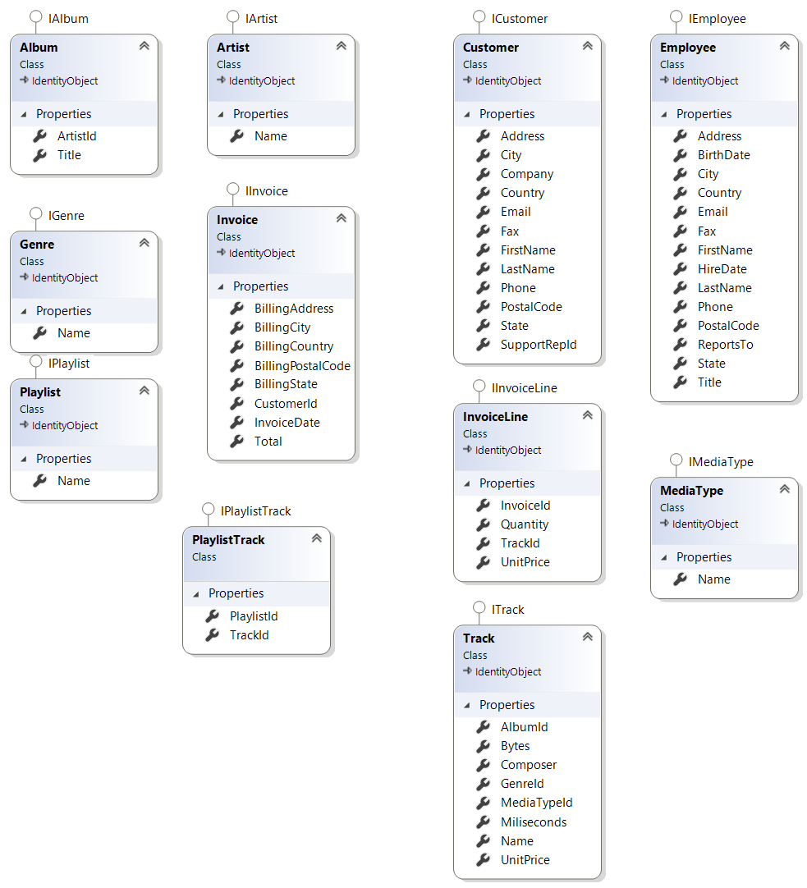

# Chinook
Chinook ist ein Media-Store mit dem Ziel, seinen Kunden den bestmöglichen Service zu bieten. Um die Dienste an den Kunden entsprechend anzupassen, benötigt die Marketing Abteilung Informationen. Das bestehende System 
beinhaltet die Stammdaten und Bewegungsdaten aus der Vergangenheit. 
Betrachten wir nun folgendes Datenmodel:

| a | | |
## Anforderungen
Die Marketing Abteilung benötigt für ihre nächsten Aktivitäten folgende Informationen aus den Datenbeständen:
* Track-Zeit-Auswertung
  * Track mit Maximalzeit [sec]
  * Track mit Minimalzeit [sec]
  * Durchschnittszeit [sec]
* Album-Zeit-Auswertung
  * Album mit Maximalzeit [sec]
  * Album mit Minimalzeit [sec]
  * Durchschnittszeit [sec]
* Track-Verkauf-Auswertung
  * Track mit der höchsten Verkaufszahl
  * Track mit der minimalen Verkaufszahl
  * Track mit dem höchsten Umsatz
  * Track mit dem geringsten Umsatz
  * Kunden-Auswertung
  * Kunde mit höchsten Umsatz
  * Kunde mit geringstem Umsatz
  * Durchschnittsumsatz
* Genre-Verkauf-Auswertung
  * Genre mit der höchsten Verkaufszahl
  * Genre mit der minimalen Verkaufszahl

_Die Auswertung erfolgt in einer einfachen Konsolenanwendung_
